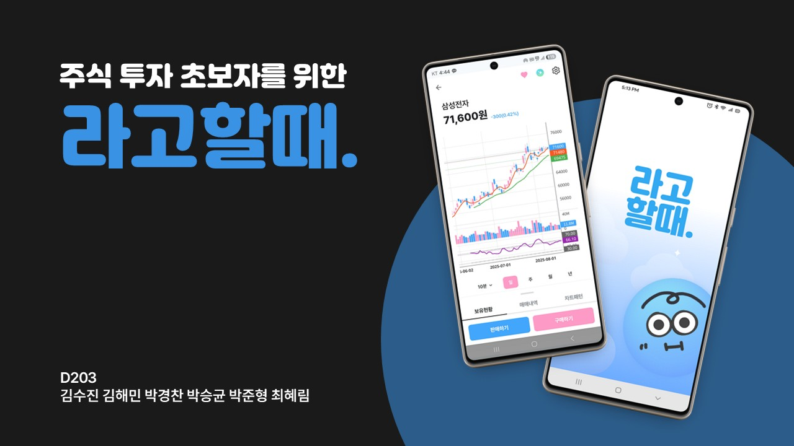
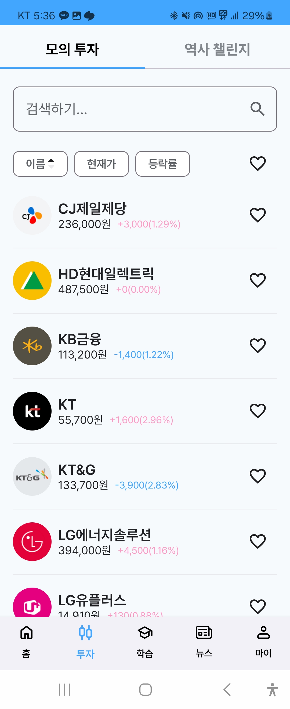
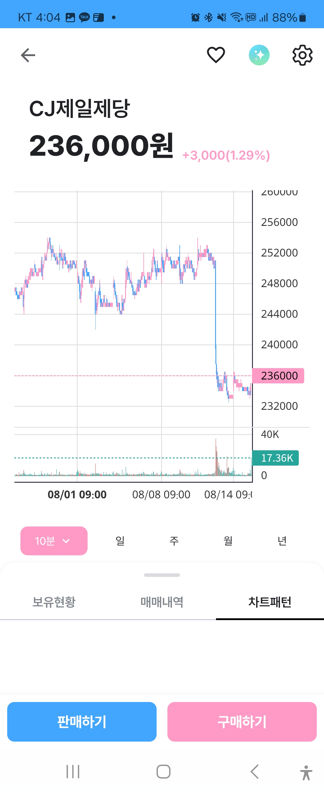
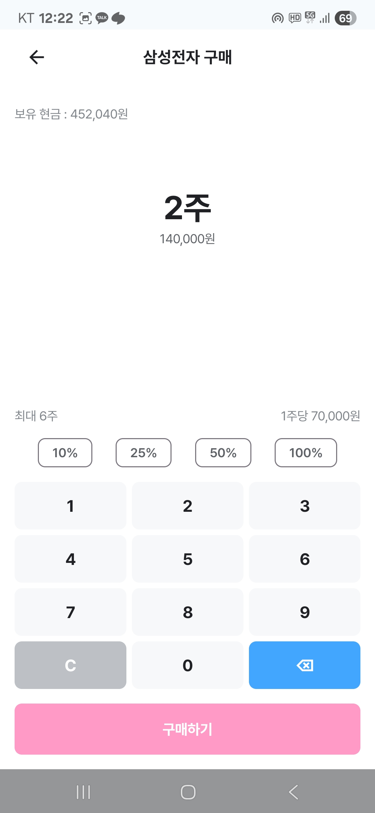
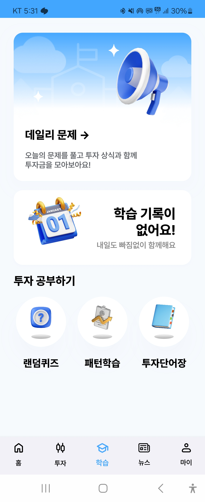
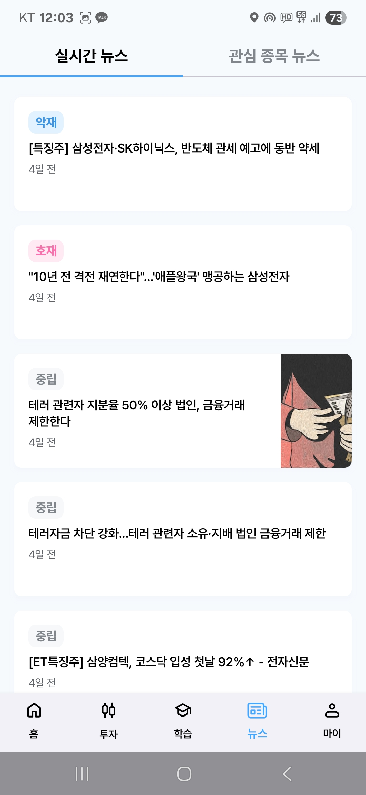
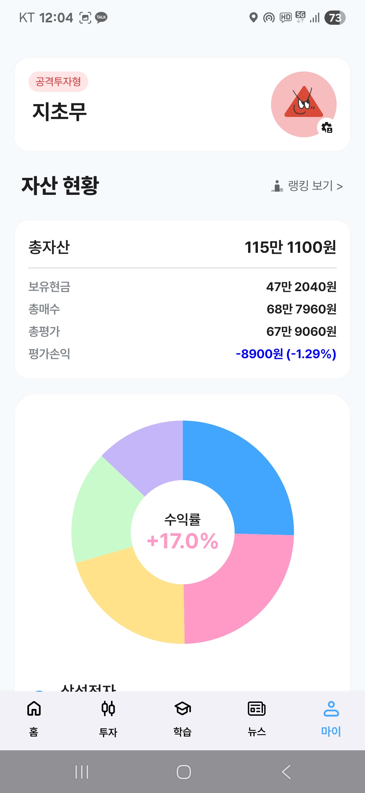
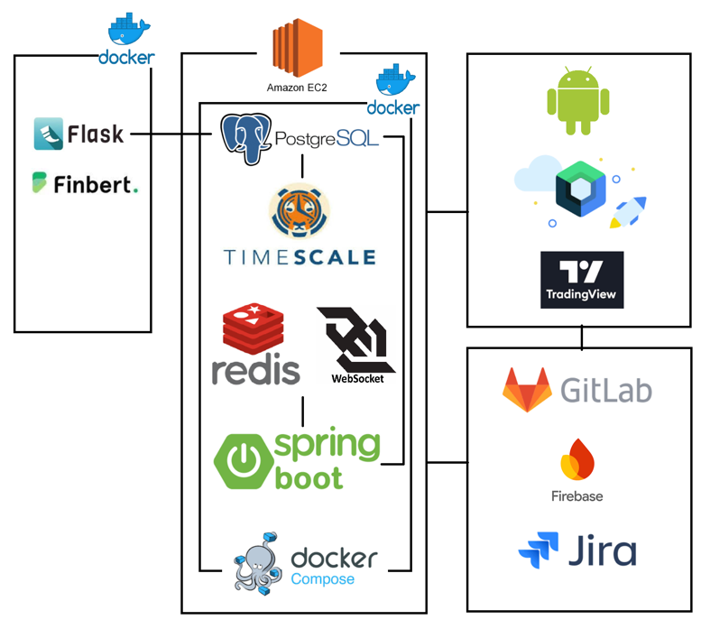

<div align="center">

# 📈 라고할때 - 모의투자 학습 서비스

주식 투자 초보자를 위한 **실시간 주가 기반 모의투자 및 금융 학습 애플리케이션**



<br/>

[▶️ 영상 포트폴리오 보러가기](https://youtu.be/wsXnRQZ3P1M)

</div>

---

## 📌 프로젝트 개요

**라고할때**는 주식 투자 초보자가 실제 주가 데이터를 기반으로 모의투자를 경험하고, 금융 용어와 차트 패턴을 학습할 수 있도록 만든 Android 애플리케이션입니다.

단순히 가상의 가격 데이터를 사용하는 것이 아니라, **한국투자증권 API를 통해 실시간 주가 데이터를 수집하고 이를 차트·모의투자 기능에 반영**하는 것을 목표로 했습니다.

| 항목 | 내용 |
|---|---|
| 프로젝트명 | 라고할때 |
| 개발 기간 | 2025.07.07 ~ 2025.08.18 |
| 진행 형태 | SSAFY 13기 공통 프로젝트 |
| 팀 규모 | 6명 |
| 담당 역할 | Backend |
| 주요 담당 | 실시간 주가 데이터 수집·처리, Redis 기반 압축 청크 저장 및 비동기 적재 흐름, TimescaleDB TICKS 테이블 OHLCV 업서트 |

---

## 👨‍💻 담당 역할

### Backend - 실시간 주가 데이터 처리 파트

실시간 주가 데이터를 수집하도록 구성하고, 차트와 모의투자 기능에서 활용할 수 있도록 데이터 처리 흐름을 구현했습니다.

- 한국투자증권 WebSocket API 기반 실시간 주가 데이터 수집
- Redis Hash/Value/ZSet을 활용한 최신가 저장, 압축 청크 저장, 비동기 적재 대기열 구성
- TimescaleDB TICKS 테이블에 1초 단위 OHLCV 데이터 업서트
- time_bucket 기반 차트 조회용 데이터 조회·집계
- 실시간 데이터 수집 → 처리 → 저장 → 조회 흐름 구성

---

## 🔄 실시간 주가 데이터 처리 흐름

~~~mermaid
flowchart LR
    A[한국투자증권 WebSocket API] --> B[실시간 주가 데이터 수신]
    B --> C[KisRealTimeDataProcessor 파싱]
    C --> D[RealtimeDataService]
    D --> E[Redis 최신가 및 압축 청크 저장]
    E --> F[Redis ZSet 기반 적재 대기열]
    F --> G[ChunkAutoIngestor]
    G --> H[TimescaleOhlcIngestService]
    H --> I[TICKS 테이블 OHLCV 업서트]
    I --> J[차트 조회 API]
    D --> K[RealTimeDataBroadcaster 실시간 전달]
~~~

### 처리 흐름

1. 한국투자증권 WebSocket API를 통해 실시간 주가 데이터 수신
2. `KisRealTimeDataProcessor`에서 원시 메시지를 파싱하여 틱 데이터로 변환
3. `RealtimeDataService`에서 Redis 최신가 Hash와 압축 청크 Value를 저장
4. `ticks:ingest:pending` ZSet 기반 적재 대기열에 청크를 등록
5. `ChunkAutoIngestor`가 대기 청크를 읽고 `TimescaleOhlcIngestService`로 전달
6. TimescaleDB `TICKS` 테이블에 1초 단위 OHLCV 데이터로 업서트
7. 저장된 데이터를 차트 및 모의투자 기능에서 활용하고, 실시간 데이터는 `RealTimeDataBroadcaster`로 전달

---

## 🚀 기술적 고민

### 1. 실시간 데이터 처리 구조

실시간 주가 데이터는 짧은 시간 동안 지속적으로 유입되기 때문에, 단순히 API 요청·응답 방식으로 처리하기 어렵다고 판단했습니다.

이를 해결하기 위해 WebSocket으로 데이터를 수신하고, Redis 기반 최신가 저장·압축 청크 저장·적재 대기열을 활용해 데이터 수집과 저장 흐름을 분리했습니다.

```text
WebSocket 수신 → 틱 데이터 파싱 → Redis 최신가/압축 청크 저장 → ZSet 적재 대기열 → TimescaleDB TICKS 업서트
```

이를 통해 실시간 데이터가 들어오는 흐름과, 데이터를 가공하고 저장하는 흐름을 분리하여 처리할 수 있도록 구성했습니다.

---

### 2. 시계열 데이터 저장과 집계

주가 데이터는 시간 순서가 중요한 시계열 데이터이기 때문에 일반적인 RDB 테이블만으로 관리할 경우, 데이터가 증가할수록 조회 및 집계 부담이 커질 수 있다고 판단했습니다.

이를 고려해 PostgreSQL 기반의 TimescaleDB를 사용했습니다.

- 시간 기준 데이터 저장 구조 구성
- 틱 데이터를 1초 단위 OHLCV 데이터로 가공하여 `TICKS` 테이블에 업서트
- `time_bucket` 기반 차트 조회용 데이터 조회·집계
- 차트 조회 시 필요한 데이터 접근 흐름 구성

---

### 3. 프로젝트 한계와 개선 방향

프로젝트 진행 중 실시간 데이터 처리량이 증가하는 상황에서 서버 부하와 처리 병목 가능성을 확인했습니다.

특히 단일 서버 환경에서 실시간 데이터 수집, 가공, 저장, 전달이 함께 이루어질 경우 부하가 집중될 수 있다는 점을 경험했습니다.

향후 개선한다면 다음과 같은 방향으로 확장할 수 있습니다.

- Kafka 등 메시지 브로커 도입을 통한 데이터 처리 구조 분리
- 실시간 수집 서버와 API 서버 분리
- 서버 리소스 모니터링 환경 구축
- 데이터 처리 지연 및 누락 여부를 추적할 수 있는 로깅 강화
- 종목 수 증가에 대비한 처리량 테스트 및 부하 테스트 수행

---

## 📱 주요 기능

| 기능 | 설명 |
|---|---|
| 실시간 주가 조회 | 실제 주가 데이터를 기반으로 종목 가격 정보 제공 |
| 모의투자 | 사용자가 가상의 자산으로 매수·매도 경험 |
| 차트 조회 | 주가 데이터를 기반으로 차트 제공 |
| 차트 패턴 분석 | 추세선과 통계적 지표를 활용한 패턴 분석 |
| 금융 학습 | 금융 용어, 차트 패턴, 퀴즈 기반 학습 기능 |
| 뉴스 | 종목 관련 뉴스 조회 및 분석 |
| 성향별 매매봇 | 투자 성향에 따른 자동 매매 시뮬레이션 |
| 마이페이지 | 자산, 거래 내역, 랭킹 등 사용자 정보 확인 |

---

## 🖼️ 주요 화면

### 실시간 주가 및 모의투자

| 종목 목록 | 차트 조회 | 매매 화면 |
|---|---|---|
|  |  |  |

### 학습 및 부가 기능

| 학습 홈 | 뉴스 | 마이페이지 |
|---|---|---|
|  |  |  |

---

## ⚒️ 시스템 아키텍처



> 담당 범위: 한국투자증권 WebSocket 실시간 데이터 수집, Redis 기반 압축 청크 저장 및 비동기 적재 흐름, TimescaleDB TICKS 테이블 OHLCV 업서트

---

## ⚙️ 기술 스택

<table>
  <tr>
    <th>분류</th>
    <th>기술</th>
  </tr>
  <tr>
    <td><b>Backend</b></td>
    <td>
      Java 21, Spring Boot, Spring Data JPA, Spring Security, WebSocket
    </td>
  </tr>
  <tr>
    <td><b>Database</b></td>
    <td>
      PostgreSQL, TimescaleDB, Redis
    </td>
  </tr>
  <tr>
    <td><b>External API</b></td>
    <td>
      한국투자증권 API
    </td>
  </tr>
  <tr>
    <td><b>Android</b></td>
    <td>
      Kotlin, Jetpack Compose, Room, Dagger Hilt, Coroutines
    </td>
  </tr>
  <tr>
    <td><b>AI / Data</b></td>
    <td>
      Flask, PyTorch, Transformers, FinBERT, Selenium
    </td>
  </tr>
  <tr>
    <td><b>Infra</b></td>
    <td>
      Docker, Docker Compose, AWS EC2, Ubuntu
    </td>
  </tr>
  <tr>
    <td><b>Collaboration</b></td>
    <td>
      GitLab, Jira, Notion, Mattermost
    </td>
  </tr>
</table>

---

## 📂 Backend 패키지 구조

```text
BE/src/main/java/com/example/LAGO/
├── ai/              # FinBERT 감정분석, AI 매매 전략
├── config/          # Security, WebSocket, Redis, KIS API 설정
├── constants/       # 상수 정의
├── converter/       # 데이터 변환
├── controller/      # REST API 컨트롤러
├── domain/          # JPA 엔티티
├── dto/             # 요청/응답 DTO
├── repository/      # 데이터 접근 계층
├── service/         # 비즈니스 로직
├── kis/             # 한국투자증권 API 연동
├── realtime/        # 실시간 데이터 처리
├── scheduler/       # 스케줄링 작업
├── utils/           # 유틸리티
└── exception/       # 예외 처리
```

### 주요 관심 패키지

| 패키지 | 설명 |
|---|---|
| `ai` | FinBERT 감정분석 및 AI 매매 전략 |
| `kis` | 한국투자증권 API 인증 및 WebSocket 연동 |
| `realtime` | 실시간 주가 데이터 처리 |
| `config` | WebSocket, Redis 등 주요 설정 |
| `service` | 주가, 차트, 매매 관련 비즈니스 로직 |
| `repository` | 주가 및 차트 데이터 저장·조회 |

---

## 📂 Android 패키지 구조

```text
com.lago.app/
├── data/
│   ├── cache/
│   ├── local/
│   ├── remote/
│   ├── repository/
│   └── service/
├── di/
├── domain/
├── fcm/
└── presentation/
    ├── ui/
    └── viewmodel/
```

---

## 📊 프로젝트 산출물

- [기능 명세서](https://www.notion.so/237085cabd3480fea27ce09b3c59625c?pvs=21)
- [와이어프레임](https://www.figma.com/design/utXuqPzMOWMkrvwPFUTlTF/%EB%9D%BC%EA%B3%A0%ED%95%A0%EB%95%8C-%EC%99%80%EC%9D%B4%EC%96%B4%ED%94%84%EB%A0%88%EC%9E%84?node-id=0-1&t=ge4MRh3gd1kZeJVe-1)
- [API 명세서](https://www.notion.so/API-22a085cabd348039bc81edc6ec3eeeec?pvs=21)
- [ERD](https://dbdiagram.io/d/689d9e061d75ee360a90baed)
- [시퀀스 다이어그램](https://www.notion.so/22a085cabd3480678fd8cd9a8e29707a?pvs=21)
- [간트 차트](https://docs.google.com/spreadsheets/d/1wQ9IBqwJeYietFdrB4bGjVusZWbprBePGl_xuRKNgzI/edit?usp=sharing)

---

## 👥 팀원 및 역할

| 이름 | Android | Backend | 기타 |
|---|---|---|---|
| 김수진 | 마이페이지, 포트폴리오, 랭킹, 뉴스 화면 | 계좌 조회 API, 관심 뉴스 API | PM, 발표, UI/UX, 기능 명세, 간트 차트 |
| 김해민 | - | 실시간 주가 API, 차트 조회 API, 관심 종목 API, Entity 생성 | 캐릭터 디자인 |
| 박경찬 | 투자 메인, 모의투자, 역사적 챌린지 화면 | 주식 거래 API, 실시간 뉴스 처리 API | PL, 프로젝트 기획, 시퀀스 다이어그램 |
| 박승균 | 메인 화면, 학습 화면, 포트폴리오, 랭킹, FCM 알림 | 단어장/퀴즈, 소셜 로그인 | 뉴스 감정 분석 |
| 박준형 | - | 성향별 매매봇 API | Infra, 서버 환경 구축, 서버 최적화, DB 설계 및 최적화 |
| 최혜림 | - | 차트 패턴 분석 API, 역사적 챌린지 API | 문서 작성, API 설계 및 명세 |

---

## 📝 회고

이번 프로젝트를 통해 단순 CRUD 중심의 백엔드 기능을 넘어, **외부 WebSocket API에서 들어오는 실시간 데이터를 수집하고 Redis 기반 적재 흐름으로 처리하는 과정**을 경험했습니다.

특히 주가 데이터처럼 시간 순서와 처리량이 중요한 데이터를 다루면서, 데이터 수집·가공·저장 구조를 분리하는 것이 왜 중요한지 체감할 수 있었습니다.

또한 TimescaleDB를 활용해 시계열 데이터를 저장하고 차트 조회에 필요한 형태로 집계하면서, 도메인 특성에 맞는 데이터베이스 선택과 데이터 모델링의 중요성을 배웠습니다.

아쉬운 점은 실시간 데이터 처리량이 증가하는 상황에 대비한 모니터링과 부하 테스트를 충분히 하지 못했다는 점입니다. 이후 유사한 프로젝트를 진행한다면 초기 단계부터 처리량 측정, 병목 추적, 서버 리소스 모니터링을 함께 설계할 것입니다.
